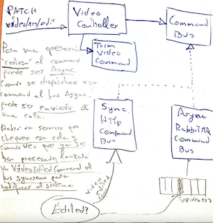

# CQRS - CodelyTv

**C**ommand **Q**uery **R**esponssiblity **S**egregation

## ¿Qué es un _Command_?

- use-case de **escritura**: POST, PUT, PATCH, DELETE.
- <u>_DTO (Data Transfer Object)_</u>, una clase "plana" que contiene los <u>datos en atributos</u>. Tiene que ser <u>serializable</u> en JSON por lo que <u>no tiene comportamiento</u>.
- Lógica de <u>infraestructura instancia un _command_</u> para <u>tirárselo al bus</u>.
- Un command es <u>inmutable</u>. Se pasan todos los <u>datos por constructor</u>. Para leer los atributos, usar <u>getters de atributos privados</u>.
- Los command <u>modifican el estado</u> de la app mediante side-effects.
- <u>No devuelven nada</u>, ya que se entiende que están modificando el estado.
- <u>Handlers</u> síncronos ó asíncronos.
- Util en apps con <u>carga grande de tráfico ó equipos/distribuidos</u>.
- Un handler **asíncrono** lanza el command y <u>no espera</u>. Se le <u>notificará</u> que la operación ha terminado <u>mediante _domainEvent_</u>.

## ¿Qué es una _Query_?

- use-case de **lectura.**
- <u>No modifica estado</u> ni tiene side-effects.
- Lo común es hacer una <u>query _`ofId()`_ y construir una proyección</u> con los datos que necesitamos.

## _CommandBus_ & _QueryBus_

- El <u>handler</u> invoca al bus.

- Un bus <u>asíncrono</u> nos da la opción de <u>mejorar rendimiento</u>.

## Async Commands

## Generación de *Id-*s desde el cliente

❌ <u>No generar</u> los ids desde:

- **\*Infra\***: por acoplamiento al adapter.
- **\*UseCase:\*** El <u>command de creación tendría que devolver el id</u>. (**SMELL**!! los commands no devuelven nada)

✅ Generar <u>desde cliente</u>. Beneficios:

- <u>Mantenimiento y cambiabilidad</u>**:** Podemos cambiar cualquier pieza sin tener que refactorizar gestión de ids.
- <u>Testing</u>: Podemos comparar entidades reales con ids.
- <u>Integridad de representación</u>: El cliente podrá establecer el atributo _id_ como requerido.

## Queries

- Una _query_ <u>devuelve un valor</u>.
- Mapea al verbo _GET_ de _Http_.

