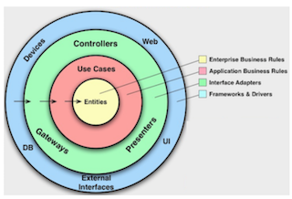
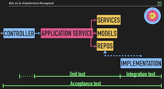

# Arquitectura Hexagonal - CodelyTv

➕ Mantenibilidad

➕ Testing

➕ Cambiabilidad

➕ Simplicidad

## ¿Que es?

- Parte de Clean Architecture (por capas) Poder cambiar lo de fuera sin lo que lo de dentro se entere.

  

  Regla de dependencia, siempre de fuera a dentro y sólo se conoce la siguiente capa.

  - **Interface/Adapters (Infra.):** El I/O. Todo lo que toque un sistema real o cambie el estado externo.
  - **Application**: Casos de uso/Application services.
  - **Entities (Domain):** Modelos, puertos, ...

## Patrón Repository

**ActiveRecord:** Las entidades del dominio tienen la lógica necesaria para ser persitidas/actualizadas, ...

_VS_

**DataMapper (pilar de Hex. Arch.):** Las entidades no conocen nada de como son manejadas en DDBB. Cuando la info llega de DDBB se mapea a los módelos.

**DAO (Data Access Object):**

Al principio puede que tenga los métodos básicos, pero con el tiempo se tiende a añadir más y más métodos (_BloatDAO_), rompiendo el ISP. Para evitarlo....

**Repository \*(specification pattern)\*:**

Para escenarios que requieres alta cambiabilidad , features, ...

- Devuelve listas de instancias del mismo tipo de entidad que es repositorio.
- Para hacer un guardado, también recibe una instancia de la entidad.
- Como las excepciones son de dominio, el repositorio no tiene excepciones. Si una búsqueda falla devolverá NULL. Será la capa posterior la que cascará cuando reciba NULL.

## Ports & Adapters

- **Puerto:** Interface _ItemRepository_ a nivel de Dominio.
- **Adapter:** Implementación _HttpItemRepository_ en la capa de Infraestructura.

## Servicios de Infraestructura

- En infra nos da igual tener imports que no son nuestros.
- Encapsular particularidades dentro de la implementación del cliente, así no contamina el _ApplicationService_.
- Inyectar dependencias (contrato por Interface).
- Los parámetros específicos de la implementación (e.g urls del SQL, ...) van en el constructor, porque así no aparecen en la Interface.
- Mockear para test.

## _ApplicationService_ VS _DomainService_

### **\*ApplicationService\* (use-case):**

- Punto de entrada de la app (_getVideoById_)
- Cierra las transacciones de DDBB y dispatchea _domainEvents._
- Diferentes ApplicationService no hablan entre sí.

### **\*DomainService:\***

- Cuando la lógica de un _ApplicationService_ está duplicada, se extrae a un _DomainService_ para ser reutilizada.
- **Nunca** dispatchea _domainEvents_.

### **Al usar un \*DomainService\* desde un \*ApplicationService\*:**

- No usar interfaces e instanciar directamente.
- No mockear en tests.

## Modelando dominio y publicando eventos

### **ValueObject:**

Clase para encapsular semántica de dominio. Por ejemplo, una clase "_Id"_ puede validar si es válido en el constructor. Eso con un "string" no lo haríamos. Además, esa validación estaría en un solo sitio, en vez de estar replicando un _if_ de validación en cada sitio.

Aquí se centraliza la lógica de dominio referente a ese valor (en este ejemplo el _Id_).

### Entidad:

Combinación de _ValueObjects_ que refleja una pieza más del dominio.

Puede tener un _namedConstructor_ que registra un evento de dominio para asegurarnos de que ha sucedido esa acción.

**Para publicar el evento (de más a menos acoplamiento):**

😔 LLamada singleton al publicar desde la entidad.

😐 Inyectar el publicador en la entidad y llamarlo al registrar el evento.

😁 Desde el caso de uso que tiene tanto la entidad y el publicador, llamar a éste una vez llamado el _namedConstructor._

```tsx
class CompleteOrderHandler implements CommandHandler<CompleteOrder> {
  private orderRepository: OrderRepository;

  public constructor(orderRepository: OrderRepository) {
    this.orderRepository = orderRepository;
  }

  public async execute({ orderId, providerId, deliveryEstimation, b2b }: CompleteOrder): Promise<void> {
    const order = await this.orderRepository.get(orderId);

    if (!order) {
      throw new Error(`There is no Order for the provided id: ${orderId}`);
    }
		// Entidad registra el evento
    **order.complete(providerId, deliveryEstimation, b2b);**
		// Pasar entidad al publicador
    **await this.orderRepository.complete(order);**
  }
}
```

## Testing capa de Aplicación y capa de Dominio

- Mockear los adapters para ahorrarnos cómputo. Pero al test, inyectarlo por puerto para mantener cambiabilidad. Así, si la implementación pasa a ser MySQL a Postgres, el test lo soporta porque el contrato está a nivel de puerto.
- Testear creación del evento y publicación.

### Tipos de tests

- Acceptance
  - Testear flujo completo (infra ↔ app ↔ dominio)
  - Ir a por los casos de uso.
- Unit Tests
  - Validar implementación.
  - Comprobación exhaustiva (sin obsesionarse).
  - Testear entradas vs salidas de las funciones públicas.
  - Testear aplicación y dominio.
- Integración/e2e:
  - Testear implementaciónes de los puertos, contra la capa de infraestructura.



## Testing capa de Infraestructura

- Testear métodos de los repositorios.
- Testear integración entre componentes de infraestructura (adapters).
- No mockear infra.
- Ojo con ir contra producción.
