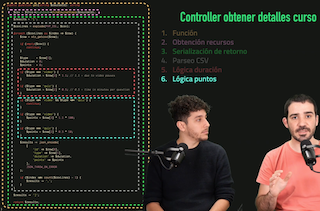
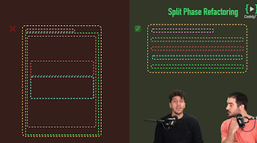
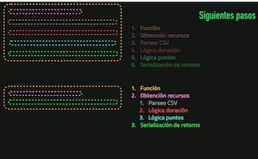

# Introducción

## ¿Que son los Code Smells de tipo Change Preventers?

Los **Code Smells** son aquellas cosas de nuestro código que <u>nos hacen detectar que algo en nuestro puede estar mal.</u>

- Los **Change Preventers** son aquellos <u>relacionados con la dificultad para cambiar nuestro código</u> en cualquier momento. 

Pongamos como ejemplo un getter que le pasemos un *courseId* y nos devuelva la información del curso en un json.

Vemos que hay puntos sobre diferente logica de negocio, eso ya nos da una pista sobre el tufillo:

- Lógica de duración
- Lógica de puntos

El **principal problema** reside en que cada cajita impregna todas las de abajo (se ve que las cajitas estan dentro):

-  La serialización de retorno impregna el parseo, que a su vez impregna  la lógica de nogocio.
- La solución sería **aislar cada cajita** y sacar las de dentro, para no que no impregne a ningun otra. (*Single Responsibiliy Principle*)

Otra vuelta de tuerca, <u>viendo que el parseo de CSV viene junto con el cálculo de duración y de puntos</u>, podría ser **usar Ports & Adapters**, metiendo un repositorio, y así <u>aislar la los detalles de implementación</u>, para no importe si obtenes los datos de un CSV, JSON, o lo que sea.

## ¿Por qué no se entiende la S de SOLID?

