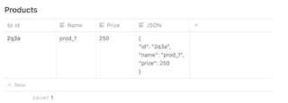
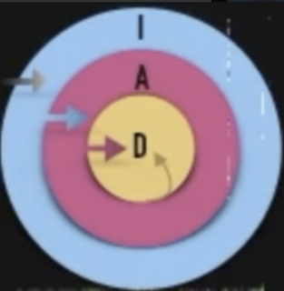

# Read Model

### Evitando JOINs denormalizando Read Model

- **En back**, en una tabla de _Productos_, podríamos tener **toda la información de un producto serializada** a JSON en una única columna por producto.

  

  Al hacer una query para conseguir un listado de Productos, esa query **nos devolvería sólo los ids** de los productos que necesitemos. Por lo que en una segunda query, iríamos con ese listado de ids a la tabla y **cogeríamos de la columna JSON toda la info por id de producto** que tengamos, en vez de hacer el select con los campos que queremos y que la DDBB filtre y lea las columnas una a una.

  Con esto **penalizamos las operaciones de escritura, pero la las de lectura ganan mucho**, favoreciendo el tiempo de respuesta y el SEO.

### Alternativas para agregar información

Habiendo dos agregados, Cursos y Lecciones, ¿qué opciones tendríamos para obtener todas las Lecciones de un Curso al obtener un Curso byId()?

**🌈 <u>Cliente => N backends</u>**

Pedir primero la información del Curso y luego hacer N peticiones por cada Lección.

- Ventajas
  - Si no quieres cargarlo todo, no tienes que hacerlo
- Inconvenientes
  - Aumenta el número de peticiones

🙋‍♂ **<u>Cliente => API Gateway (a.k.a \*Backend for Frontends\*) => N Backends</u>**

Consiste en situar un **sistema ‘delante’ de nuestras APIs**, ocupándose de realizar las N peticiones necesarias y **mergeándo las responses en una única que es devuelta al frontend**. Se pueden aprovechar los Headers de la request del front para la autenticación, tipo de response, etc. para las requests desde el API Gateway a los Backends.

- Ventajas
  - Orquestar las peticiones y unificar la respuesta en el Gateway
  - Encapsular lógica fuera del backend
- Inconvenientes
  - Supone la creación de un stack nuevo

**👂<u>Cliente => 1 Backend => Application Service => Info agregada por eventos</u>**

Que el front haga una sola petición al Backend. Ahi un **ApplicationService** tendrá toda la información agregada que habrá ido acumulando al escuchar eventos.

- Ventajas
  - Se recoge toda la información realizando una única petición al backend
- Inconvenientes
  - Supone la creación de toda la infraestructura necesaria para la publicación y susbscripción a los eventos (Mayor coste de infraestructura)
  - Controlar la posible generación de eventos duplicados o desordenados.

**🔀 <u>Cliente => 1 Backend => 1 Controller => N queries</u>**

Que el cliente haga una sola petición al back, y éste, en un **controlador (no ApplicationService)**, hacer **N queries** para obtener todos los datos. Para finalmente **mergear toda la info y devolver una única response**.

Así, los Application Services no conocen acerca del resto de módulos, **esto se lo dejaremos a la capa mas externa (infra.).** Recordar:

- Ventajas
  - Se recoge toda la información realizando una única petición al backend
- Inconvenientes:
  - Dependiendo del tipo de rendimiento que necesitemos puede no ser la mejor opción.

⚛️ **GraphQL???**

Investigar solución
