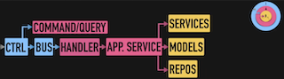

# Lenguaje ubicuo y flujo de trabajo outside-in en DDD

**_Outside-in_:** De fuera hacia dentro

El lenguaje ubicuo nos vendrá dado desde el dominio, con lo que tendrá más que ver con las necesidades del cliente que con detalles de la infraestructura

# Definiendo una nueva Feature

Importante reunirnos **todos** con la gente que defina la nueva feature para saber lo que realmente se quiere. Hacer un **\*[event-storming](https://en.wikipedia.org/wiki/Event_storming)\*** (definir comportamiento en base a eventos de dominio) para descubrir nuevos contextos.

También es importante **definir los contratos** de las llamadas, así se evitan bloqueos. Ya que:

- El que tenga que trabajar en el cliente, podrá **"mockear" los datos que quiera y seguir su desarrollo** sin tener que esperar a que el endpoint este live.
- En el lado del servidor, ya sabremos qué datos necesitamos mandar y se puede planificar y paralelizar el trabajo.

**Gracias al hecho de haber empezado desde fuera hacia dentro (outside-in), será imposible que la infraestructura (la implementación que definamos para la interfaz del repo) condicione el caso de uso**. Porque <u>habremos dejado para el final los detalles de implementación de la infraestructura, evitando que éstos condicionen el diseño en las capas de aplicación y dominio</u>.

Además, si hemos desarrollado hasta este punto, aunque no hayamos alcanzado los detalles de implementación, podremos ya testear unitariamente nuestro caso de uso

