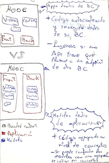
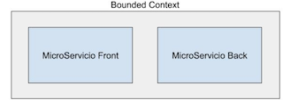
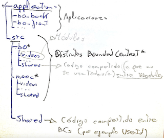

# Bounded Contexts, subdomains y modulos: Creando nuestra aplicación

# Como definir Bounded Contexts

<u>Mantener el lenguaje ubicuo</u>. Desde el negocio a la aplicación.

- **Módulos:** Elementos que tienen sentido dentro de un BC (pensar en <u>mini-BCs</u>). Un módulo dentro de un BC puede no tener sentido dentro de otro BC.

- **Aplicaciones**:

  El "como y dónde queremos desplegar" (web, mobile, ...).

  - No nos interesa meterlo dentro de un BC.

# Diferencias entre Bounded Context, Microservicios, Subdomains, Modules y Shared Kernel

- **Subdomain:** Parecido al BC. El subdomain referencia a la <u>problemática</u> y el BC a la <u>solución</u>.
- **Microservicio:** Suelen ir 1:1 en relación al BC, pero podrían ser 2:1.

- **Shared Kernel:** <u>Código compartido</u> entre diferentes BCs, o entre Módulos dentro de un BC.
  - La lógica tiene que ser la menor posible para evitar el acoplamiento.
  - Si me llevo un <u>BC a otro proyecto, también me llevaré su Shared Kernel.</u>

# Estructura de carpetas (MonoRepo)

