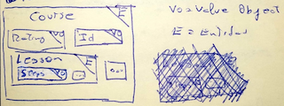
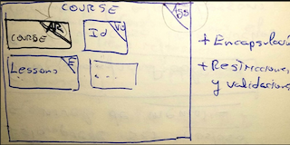
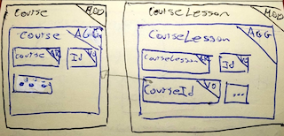
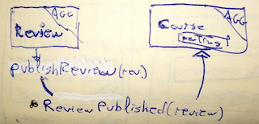

# Entidades, Agregados y Aggregate Root

## Introducción a Agregados

Teniendo una <u>entidad "_Curso_"</u>:

La entidad "_Curso"_ engloba varios VOs y Entidades.

Para no acoplarnos a la lógica interna y, por ejemplo, llamar `course.lessons[1].steps` definiremos un _AggregateRoot_.

### **Agregado & AggregateRoot:**

Un <u>Agregado</u> es el <u>elemento conceptual que engloba</u> otras entidades y su <u>punto de entrada es el Aggregate Root</u>.

Agg= Agregato; AR= AggregateRoot; VO = ValueObject

_Course_ (Agg) engloba el resto y <u>la clase _Course_ (AR) es el punto de entrada</u>. Ahora <u>para coger los steps de una lección haríamos</u> <u>`course.getSteps(lessonId)`</u> sin tener que acoplarnos a la implementación. **TELL, DON'T ASK!**

El problema ahora es que <u>necesitaríamos levantar toda el `course` para coger una lección</u>, ya que _Course_ es el AR. <u>Puede ser costoso a nivel de memoria</u>.

## Solucionando problemas

Cuando un curso tiene muchas lecciones o la entidad Lessons ha crecido mucho, <u>hacer una query puede ser costoso</u> porque siendo Course el AR <u>tendríamos que sacar toda la info relativa a un curso</u>.

**Solución:** <u>Extraer</u> _Lesson_ a su propio AR.

AGG = agregado; AR = AggregateRoot; VO = ValueObject

- Extrayendo _CourseLesson_, el agregado tiene <u>referencia al curso al que pertenece</u> (_courseId_).
- <u>_Course_ se vuelve "más tonto"</u> y no sabe nada sobre _Lessons_.
- Como cada AGG tiene su <u>lógica encapsulada, nos facilita sacar módulos</u>.

### ¿Dónde poner validaciones?

Las comprobaciones/validaciones de <u>antes de ejecutar el caso de uso</u> las pondremos <u>en un _DomainService_</u>.

### Asegurando consistencia

La consistencia entre agregados (que un _Rating_ se ha publicado para un _Course_, cambiar _totalSteps_, ... ) se hace mediante <u>_DomainEvents_</u>.

_ReviewPublished_ es el evento con el que se notificará a todo el que esté escuchando.
