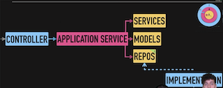
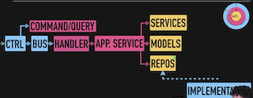
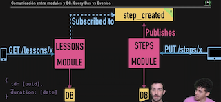

# CQRS en DDD

### Flujo petición CQRS vs Hexagonal

"**Solo" hexagonal:**

Si no necesitariamos aplicar CQRS, nos quedaríamos con esta arquitectura, pero sí que nos quedaríamos con la idea de DTOs, que devolverian nuestros application-services.

**Hexagonal + CQRS:**

Las interacciones con los casos de uso se harían mediante las _commands_ (escritura) y _queries_ (lectura). Entonces, una vez que se lancen las **queries/commands al bus** (este bus contiene el **\*handler locator\*** en el que se encuentra mapeada la relación 1 a 1 entre Commands/Queries y sus Handlers) **y se lean, se ejecutará su handler** correspondiente, que sabrá del **app. service y llamará al caso de uso**.

El bus no tiene por qué ser una clase nuestra, si no que puede ser un bus asíncrono de eventos (ej. rabbit) que ira leyendo los eventos y ejecutará los handlers según toque. Por eso pertenece a la capa de **infraestructura**.

## ReadModel: Optimizando para la léctura

### Comunicar modules y Bounded Contexts: Query Bus vs Eventos

Cuando queramos consultar la duración de un _Lesson_, en vez de lanzar una query cada vez. contra el modulo de _Steps_ para saber la duración de cada step de un _Lesson_ y calcular el SUM, podemos publicar un _step_created_ con la información del step creado para que el _Lesson_ se subscriba a él y sea notificado.

Con esta alternativa, en lugar de realizar el cálculo cada vez que se haga una consulta sobre Lessons (que serán muchas), lo **calculamos la \*duration\* sólo en el momento de insertar o modificar un Step**. Nuestro **\*Lessons\* que va a tener un campo duration que inicialmente será 0** pero que se **actualizará cuando insertemos, modifiquemos o eliminemos un Step**. Finalmente también estamos **desacoplándonos totalmente entre módulos**, ya que nos limitaremos a enviar una Query al Bus, el cual nos devolverá un DTO como response y **desde el módulo de Lessons no sabremos cómo se modelan los Steps ni cómo se calcula la duración.**

### Nueva feature: Horas totales de una lección

- **Truqui:** Para cuando queramos "debouncear" eventos, podemos guardar el _timestamp_ del evento para pillar el último dentro de la venta de tiempo.
- En los subscriber, podríamos **violar OCP de SOLID** ya que cada vez que queramos añadir un nuevo tipo de Step tendremos que venir a añadirlo también a este subscriber. **Una solución a este problema sería a través de herencia** de eventos, indicando que escuchara a todos los tipos de eventos que hereden de un tipo concreto.
  - En **herencia** es que no estamos compartiendo comportamientos, sino una serie de **atributos que si son comunes** a todos los tipos.
