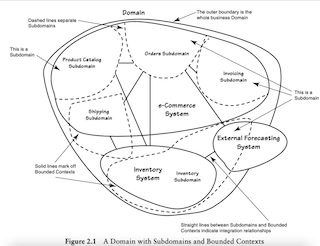
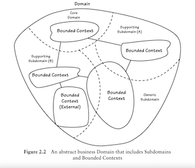
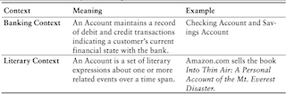

# **Chapter 2: Domains, Subdomains, and Bounded Contexts**

A **Domain**, in the broad sense, is what an organization does and the world it does it in. It can refer to both the entire domain of the business, as well as just one core or supporting area of it.

The whole Domain of the organization is composed of **Subdomains**. Using DDD, models are developed in **Bounded Contexts**. In fact, developing a Domain Model is actually one way that we focus on only one specific area of the whole business domain.

There are different functions that make any business successful, so it’s advantageous to think about each of those business functions separately. This is how subdomains are built inside domains.

# Subdomains and Bounded Contexts at Work.

Think of a retail company that sells products online. The company must:

- Present a catalog of products to shoppers.
- It must allow orders to be placed.
- It must collect payment for the products sold.
- It must ship the products to buyers.

So the Domain could be composed in these SubDomains:

- Catalog.
- Orders.
- Payments.
- Shipping.



Notice the three physicall systems (e-commerce, inventory and external-forecasting), which only 2 are hosted internally. These are the ones reffered as **Bounded Contexts**. These can point you how to separate and decouple concerns.

These *Bounded Contexts* are attached to the bussiness's real world constraints, for example how to manage stock between seasons.  When it solves a non-trivial problem, we can relate it as a **Core Domain**. When this Core Domain has a subdomain which is used to solve the problem but is not strictly attached to the problem solution (e.g different sets of algorithms to calculate stock), we can separate them from the Core using **Modules**.

Note that a Bounded Context can fall into single or multiple subdomains.

A concept can have different meaning depending on the Bounded Context. When a user is browsing the Catalog, Customer means one thing, but when a user is placing an Order, it means something else. The way domain experts describe each of these concepts could lead to separating some in different Bounded Contexts.

**Concept Maps** could help us view specific kinds of relationships involved in integration.

# Focus on the Core Domain

Our business goals are on a path of continuous refinement and expansion reflected by ever-changing subdomains and the model within. Of course, you may not know about every Subdomain and Bounded Context in your entire enterprise, especially if your Domain is really large and complex.



- A **Core Domain** is a part of the business Domain that is of primary importance to the success of the organization. The business must excel with its Core Domain.
- If a Bounded Context models some aspect of the business that is essential, yet not Core, it is a **Supporting Subdomain**.
- If it captures nothing special to the business, yet is required for the overall business solution, it is a **Generic Subdomain.**

> Remember! Ask the Domain Experts! Discuss each Subdomain and Bounded Context in your drawing with a few domain experts who specialize in the different areas.

# Why Strategic Design is so essential

**Focus on the big picture** at first. Model Domains and **worry about ValueObjects and Entities later**.

> After you identify and name a Domain, it will have an equally named Bounded Context. This Bounded Context could not be the only one in the domain, though. We could have a Collaboration Context because it is the Bounded Context that contains the domain model of the Collaboration project.

The **firstly taken approach can change on the future**. Once you start working on the solution **you can figure out some mistakes in the first modeling and iterate on it**.

Beware of the **Big Ball of Mud**, which is a big mess produced by the lack of a good modeling. What **the team really needs to understand was their business Domain, its Subdomains, as well as the Bounded Contexts** they are developing. Doing so would prevent the entry of the dastardly foe of strategic design, the muck of the Big Ball of Mud. Thus, the team needed to gain a strategic modeling mindset.

# Real World Domains and Subdomains

Domains have both:

- **Problem space.** Enables us to think of a strategic business challenge to be solved.

- **Solution space.** Focuses on how we will implement the software to solve the problem.

  ### Problem Space

  **The parts of the Domain that need to be developed to deliver a new Core Domain,** examining *Subdomains* that already exist and those that are needed. So we can say that is **the combination of the Core Domain and the Sub- domains it must use**.

  The Subdomains in the problem space are usually different from project to project. So they **allow us to rapidly view differ- ent parts of the Domain that are necessary to solve a specific problem**.

  ### Solution Space

  One or more Bounded Contexts, a set of specific software models. **The Bounded Context is used to realize a specific solution as software**.

The goal is to **align Subdomains one-to-one with Bounded Contexts** in order to seggregate domain models into well-defined areas of business by objective.

**In a legacy system**, and probably a Big Ball of Mud, however, **Subdomains often intersect Bounded Contexts**.

Before we can execute a specific solution, we need to make an assessment of the problem space and the solution space. Consider answering these questions:

- What is the name of and **vision** for the strategic Core Domain?
- What **concepts** should be considered part of the strategic Core Domain
- What are the **necessary** Supporting **Subdomains** and the Generic Subdomains?
- **Who** should do the **work** in each area of the domain?
- Can the right **teams** be assembled?

When you have a good understanding of the problem space, you then **turn to the solution space**. Consider these questions:

- What software assets already exist, and can they be **reused**?
- What assets need to be **acquired or created**?
- How are all of these **connected** to each other, or **integrated**?
- What **additional integration** will be needed?
- Given the existing assets and those that need to be created, what is the required **effort**?
- Do the strategic initiative and all supporting projects have a high **proba- bility of success**, or will any one of them cause the overall program to be delayed or even fail?
- Where are the terms of the **Ubiquitous Languages** involved completely different?
- Where is there **overlap** **and sharing of concepts and data between Bounded Contexts**?
- How are shared terms and/or overlapping concepts mapped and **translated between the Bounded Contexts**?
- Which Bounded Context **contains the concepts that address the Core Domain** and which of the tactical patterns will be used to model it?

# Making sense of Bounded Contexts

A Bounded Context is **an explicit boundary within which a domain model exists**. **Inside** the boundary **all terms and phrases of the Ubiquitous Language have specific meaning**, and the model reflects the Language with exactness.

**In two explicitly different models, objects with the same or similar names have different meanings**.



These two Bounded Contexts are probably not in the same Domain. The point is to demonstrate that **context is king**.

## Context is King in DDD

We don’t need to give the name *Checking Account* to the object in the *Checking Context* or the name *Savings Account* to the object in the *Savings Context*. Both concepts may safely be named *Account* because **each Bounded Context distinguishes subtle meanings**.

If you see the exact same objects in multiple contexts, it probably means there is some modeling error, unless the two Bounded Contexts are using a ***Shared Kernel**.*

## Room for more than the model

The model is the **primary** occupant of the conceptual container.Often, it has a service, application, ...

**When the model drives the creation of a persistence database schema, the database schema will live inside the boundary.** Database table names and column names, for example, will directly reflect names used in the model.

```java
public class BacklogItem extends Entity  {
    ...
    private BacklogItemId backlogItemId;
    private BusinessPriority businessPriority;
    ...
}
CREATE TABLE `tbl_backlog_item` (
     ...
    `backlog_item_id_id` varchar(36) NOT NULL,
    `business_priority_ratings_benefit` int NOT NULL,
    `business_priority_ratings_cost` int NOT NULL,
    `business_priority_ratings_penalty` int NOT NULL,
    `business_priority_ratings_risk` int NOT NULL,
    ...
) ENGINE=InnoDB;
```

On the other hand, **if a database schema is preexisting or if a separate team of data modelers forces contradicting designs on the database schema, the schema does not live within the Bounded Context occupied by the domain model.**

❌ Do not drag domain concepts that belong in the model into other areas of the system **(Smart UI Anti-Pattern)**.

✅ Execution of domain logic must delegate to **Application Services**, which are inside the boundary.

The Bounded Context primarily encapsulates the Ubiquitous Language and its domain model, but it includes what exists to provide interaction with and support of the domain model.

## Size of Bounded Contexts

Should be **as big as it needs to be in order to fully express its complete Ubiquitous Language**.

If one or more **extraneous concepts** creep in the Core Model, **get rid of them**. They probably belong in a separate Supporting or Generic Subdomain, or in no model at all.

Tools such as **Context Maps** can help shape the Core Domain.

**Beware** of wrong sized Bounded Contexts. Do not fell under influence of:

❌ Architectural/technical influences (constraints, ways or doing things, ...)

❌ Context division guided by team distribution made before applying DDD.

Apply **modules** carefully:

- Use them for **a set of services that are spread** across multiple “Bounded Contexts”.
- To **divide developer responsibilities.**

## Aligning with Technical Components

Is best for one well-defined, cohesive team of domain experts and developers to focus on one Ubiquitous Language modeled in a **single explicit Bounded Context**. If you assign two or more distinct teams to one Bounded Context, each team will contribute to a **divergent and ill-defined Ubiquitous Language**.

Two teams will cooperate in the design of a **Shared Kernel.**

### Responsibility Layers

- Divide **features into different lógical layers** in the domain.
- Intended to address **large-scale models**, or to plan for those that will eventually grow to a large scale.
- Each layer is meant to **remain in the model** because it is part of the Core Domain.

### Segregated Core

- Separate **features by packages**, almost into different Bounded Contexts.
- The time to chop out a Segregated Core is when you have a large Bounded Context that is critical to the system, but **where the essential part of the model is being obscured by a great deal of supporting capability**.

**Domain Events** are published when model behavior cause state transformations. They are named in past tense, describing what has happened (*OrderCanceled*, *OrderCompleted*, ...).