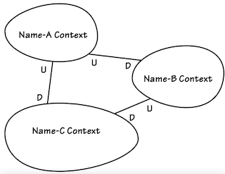
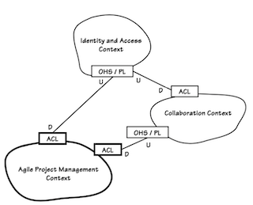

# **Chapter 3: Context Maps**

Two ways of Context Maps:

### **Diagram** showing the mapping between multiple Bounded Contexts.

- Easiest.
- You're **drawing what already exists**.



# Why are so essential?

- Draw a simple diagram of your Bounded Context. This is the **map of your team**.

- When interacting with the 

  BigBallOfMud

  , its team wont worry about your system/map but as long as you adhere to it's API. But your map 

  must reflect the relationship

   with the monolith because it will 

  indicate areas where inter-team communication is imperative

  .

  - A Context Map serves as a catalyst for inter-team communication.

- By drawing a Context Map early, you will be forced to think carefully about your relationships with all other projects you depend on, avoiding unexpected situations/failures.

## Drawing Context Maps

- You should 

  map the present

  , not the imagined future. Update the map once the landscape changes, not sooner.

  - **Understand where you are to decide where to go**.

- Besides **boundaries, relationships, and translations**, we may want to include other items such as **Modules**, significant **Aggregates**, perhaps how teams are allocated, and any other information **relevant to the Contexts**.

- Make the map **easily usable**. The more difficult it's to use, the fewer people will use it.

- **Not an Enterprise Architecture or system topology diagram** but they can show how models interact and show possible defficiencies.

- **Use them.** Context Maps will be hidden in plain sight unless the team pays regular attention to them through meaningful discussion.

## Projects and Organizational Relationships

Different types of relationships between Bounded Contexts:

- Partnership

  . Two contexts succeed or fail together. The teams must cooperate on the evolution of their interfaces to accommodate the development needs of both systems

  - ❓ Could be both merged into a single bounded context?

- **Shared kernel**. Wrap shared models between multiple contexts into a reusable one.

- Customer-supplier (a.k.a upstream-downstream)

  . The fate of the customer may depend on the supplier. Supplier priorities condition customer planning. 

  Upstream models have influences on downstream models

  , like polluting a river at the start will pollute the water in later towns. Need negotiation between both parts to prioritize work. Different variations:

  - **Conformist**. As customer-supplier, but **when the supplier does not worry about the customer**, and the customer slavishly adheres to the model of the supplier.
  - **Anticorruption Layer (\*ACL\*)**. **Defensive** layer to communicate with the mud. If a communication with the supplier (mud) brakes something, it will **break here without affecting the customer.**

- **Open Host Service (\*OHS\*)**. Give access to your **subsystem as a set of services**.

- Published language (*PL*)

  . Two Bounded Contexts require a common language. Published Language is often combined with Open Host Service.

  - ❓why not shared kernel if it's pulbished?

- **Separate ways**. Two models that dont have anything in common, they can be cut loose. Integration is expensive. A bounded context that it has no connections with the others at all.

- **Big Ball of Mud**. Mixed messy models. Draw a boundary between it and dont try to apply iterate over it.

## Mapping the contexts

- At first you can identify clearly a Bounded Context, and the shape of it's boundary can help you identify other Bounded Contexts.

- Any **foreign concepts entering the boundaries need to demonstrate the right to be there**.

- The **strict use of the language** of a Bounded Context helps its team to involve and keep vision correctly.

- Identifying different subdomains

   in a single Bounded Context, can point that this Bounded Context can be split.

  - The more knowledge about the domain, the cleaner the boundaries.

- **New Context Maps will appear** and old ones will be obsolete. Thought and discussion help to refine maps, such as integration points.

- **Don't worry about future** models.

- Applying high-level **strategic design at early stage** would help all teams understand where their responsibilities lay.

- Design in ways to drastically l**imit direct real-time dependencies**.

- Replication would force the local system to take on many undesirable responsibilities

  - ❓ basics???

### Common patterns



- Downstream

   relations always as ACL (Anticorruption Layer)

  - Put an ACL behind a Repository and use that Port (Domain Service) to interact with the Provider/Mud.

- Upstream

   as OHS/PL

  - **Open Host Service**: Rest-based services to allow clients interact with.

  - Published Language

    : Representation of the domain concepts.

    - Representation can be formed by **Domain Events**, to deliver messages for subscribed systems.

- Gain autonomy 

  placing dependant state inside

   the domain.

  - Create local domain **objects translated from the foreign model**, maintaining only the **minimal amount of state.** It’s not only to limit our need to synchronize data, it’s also a matter of **modeling concepts properly.**
  - Synchronize via messages (REST, message queues, ...)

## Interaction between Contexts

- Beware that two Bounded Context use the same data, but depending on the Context they are different types, objects, and have different behavior. So interaction and synchronization is critical.

- Leverage eventual consistency using **Domain Events** and an **Event-Driven Architecture.** Communicate each other via messages which allow telling others that event happened.

- Two systems using a "Discussion" entity, which each Contexts has its own copy with the needed data. What happens when one context creates a Discussion, but **the other Context is unavailable** so it can't be synchronized? **This scenario has to be modeled too**.

  - E.g make unavailability scenarios explicit and act in consequence.

  ```java
  public enum DiscussionAvailability {
      ADD_ON_NOT_ENABLED, NOT_REQUESTED, REQUESTED, READY;
  }
  public final class Discussion implements Serializable {
      private DiscussionAvailability availability;
      private DiscussionDescriptor descriptor;
      ...
  }
  public class Product extends Entity {
  ```

The actual mechanisms will be **determined by Customer-Supplier negotiations between the teams.**

> **Include any relevant, high-level elements** that will lead to vital team communication. On the other hand, **push back when detail seems ceremonious**. **Document it and keep discussions** about the project flowing back to your Map to stimulate useful refinements.

- The trick is to balance the need to **understand with practicality and use only what you need from this level.**
- If we reject ceremony and embrace simplicity and agility, we’ll produce useful Context Maps that help us move forward rather than bog down the project.