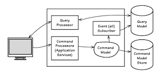
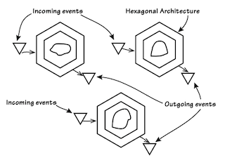

# Chapter 4: Architecture *(Partially Unread)*

### *UNREAD 1st half!*

## Command-Query Responsibility Segregation (CQRS)

- Map Domain data to views.
- A ***command* that performs an action** (and does not return anything), or a ***query* that returns data**.
- **Aggregates would not have query methods** **(getters)**, only commands (to modify state). 
- Use **Commands through Repositories** and **Queries from through Views**.
  - Do not use Repositories to query objects. -->❓❓❓ById requests on repositories for latest data)

### Examining Areas of CQRS

#### Client and Query processor

- The client (web, app,...) can ask for queries to the query-porcessor, which will return a simple serialized JSON that can match an expected DTO.

#### Query Model (Write Model)

- Only deliver data, not domain behavior. 
- Query and DDBB Table-View relation can possibly be 1:1.
- A usefull approach can be to persist all Events in order to serve or re-create data specific views.  

#### Client Drives Command Processing

- A command is dispatched to **execute behavior on an Aggregate**. 
- The command contains the **name of the behavior**.
- To accomplish this the user interface must collect the data necessary to **correctly parameterize the command**.

#### Command Processor

- A command is received by its **Handler**, which can have different styles:
  - **Categoryzed style**. Several handlers in an Application Service.
  - **Dedicated style**. Each handler within a single class with a single *handle()* method. 
  - In **both styles**, <u>handlers should decoupled from one to other.</u> Do not make one depend on/makes use of other.
- To avoid over-complexity, start with synchronous commands and **switch to async only if scalability requirements demand it**.

#### Command Model (or Write Model) executes behavior

- When the Command Handler completes, **a single Aggregate instance has been updated and a Domain Event has been published** by the repository. 
- These **events may cause the synchronization of other Aggregates** to mantain consistency.
- Consider that one command may not dispatch any Domain Event (for example when at-least-once scenarios).

#### EventSubscriber Updates the Query Model

- When an event happens, updates the Queries in order to make their consumers receive the latest data.

#### Dealing with an Eventually Consistent Query Model

- Be carefull when multiple users are updating the same entity.
  - ById() before dispatching the command?

## Event-Driven Architecture (EDA)

- It does not have to be hexagonal but it would be well worth it to consider using **Hexagonal as the overarching style**.

