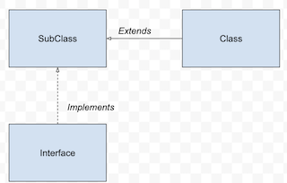

# SOLID - CodelyTv

## UML

## Single Responsibility Principle (SRP)

Truco para comprobar: "_Ir a las clases de servicio (emailService). Si tienen **más de un método público**, tiene un más de un punto de entrada. Por lo que puede hacer más de una cosa_"

Cuidado con los nombres.

## Open-Close Principle (OCP)

Abierto a **extensión** + Cerrado modificación.

## Liskov Substitution Principle (LSP)

Si **S es subtipo de T**, instancias de T deberían de poderse sustituir por S **sin alterar la lógica** del programa.

Aitxen metoduak eta semienak emaitz iguala euki bihar dabe.

**SRP + LSP = OCP**

## Interface Segregation Principle

Una interfaz no debería de tener métodos que al pasarse a un cliente no se usen. Sólo poner lo necesario según el caso de uso.

✅ **Role Interfaces:** Escribir la interfaz basada en el contrato del caso de uso para luego hacer la implementación.

**❌ Header Interfaces:** Cuando se hace toda la implementación y luego se sacan las firmas a la interfaz.

- No obligar a implementar métodos que no se usen sólo por implementar una interfaz.
- Segregar responsabilidades de una interfaz grande en varias pequeñas según los casos de uso e implementar sólo las necesarias (cuidado con SRP).

## Dependency Inversion Principle

Los módulos deberían de depender de abstracciones (interfaces usando LSP) en vez de implementaciones concretas.

- LSP como premisa:
  - Interfaces como muro de contención frente a clases que dependan de terceros (SDKs, conexiones a DDBB, librerías, I/O para facilitar testeo, ...).
  - Con código nuestro no es estrictamente necesario.

## Specification Pattern

Intentar no acoplarnos a terceros.

## Composition over inheritance

_+ Composición_

_- Herencia_

- La composición facilita el testing. Las dependencias se pueden mockear facilmente, la herencia no.
- Usar la herencia sólo cuando sea necesario.
- _Final_ (no extensible) por defecto (para capar la herencia)
