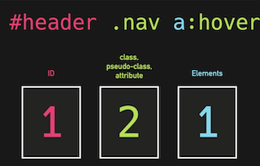
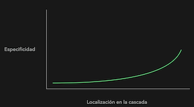
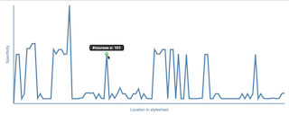
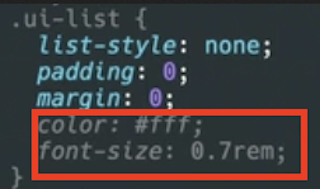
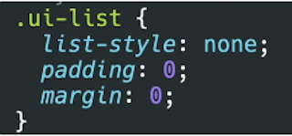
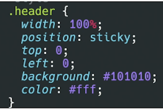
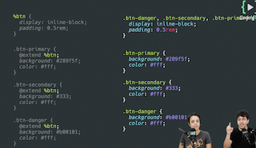
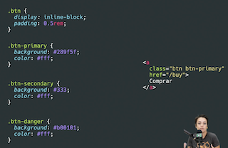

# **Buenas practicas al escribir clases en CSS**

# **Visualiza la calidad de tu CSS: Especificidad de los selectores**

Ejemplos por orden de prioridad:

1. **id:** `#header`
2. **clase:** `.header`
3. **pseudo-clase:** `:hover`
4. **elemento:** `div`

Un ***id\* siempre ganará a una \*(pseudo)clase\*, y éste siempre ganará a un element**. Es decir:

`.header{}` siempre ganará a `body acticle section div h3{}` por mucho que en los elementos se especifique la "jerarquía" exacta.

Lo **recomendado** es **usar clases siempre**, a no ser que sea un caso excepcional (por ej. seleccionar un elemento del DOM desde javascript). Donde podríamos **especificar un prefijo para dar constancia** del fin. Por ejemplo `#js-button1`

Calculo de la numeración de la especificodad:



El estilo **inline siempre se impondrá al estilo definido en fichero** (ojo con las `!important`).

Como los estilos se leen en cascada, **el que se lee después puede sobrescribir al anterior**.  Por lo que **los menos específicos se deben de poner al principio y los más al final**:

```css
a{
	...
}

/* sobrescibe al a */
.button {
  ...
}

/* sobrescribe al .button */
.button-primary {
	...
}
```

### Gráfico de especificidad:

La curva ideal debería de ser asi:



Una herramienta útil puede para comprobar esto: [specifity-graph](https://jonassebastianohlsson.com/specificity-graph/)

❌ Mal asunto:                                                                      



✅ Buena curva:


# Single Responsibility Principle in CSS

Por ejemplo, si queremos pintar una lista pero convertirlo en una lista de UI. Es decir:

- Quitar los bullets.
- Quitarle el padding.


El **SRP dependerá mucho del naming** que usemos para las clases. Por lo que si para convertir la lista en una UiList, usáramos una clase .ui-list se tendría que encargar de solo eso:


❌ Si en el `.ui-list` estamos diciendo que el color del texto, etc. estamos dando **más de una responsabilidad** a esa clase.



**Si se piensa que la clase se va a reutilizar**, La clase que cumpla el SRP debería de **encargarse sólo de una cosa y con el nombre mas genérico posible**.



Si **no se va a reutilizar** el estilo (por ejemplo, para el header/cabecera de la app) tendría sentido que **su clase se encargase del estilo general/theming** (colores, posicionamiento, etc. ) ya qué **solo va a haber un header**.



# Herencia VS Composición en CSS

# ❌ Herencia

La **herencia** la podemos conseguir mediante el `@extends` se Scss. Aún así, la herencia **nos puede acoplar clases entre sí** que tienen poco en común pero que comparten demasiado entre sí.



# ✅ Composición

La **composición** nos puede **facilitar** más la vida.  Simplemente teniendo clases cumpliendo SRP, podemos componer poniendo las clases que necesitemos en el elemento.

