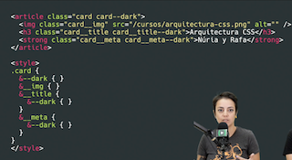
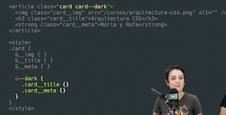
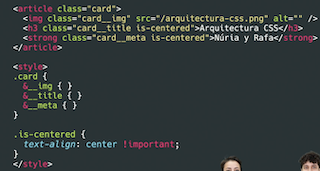

# Nomenclatura BEM

```css
.card { } /* Block */
.card__button { } /* Element */
.card__button--primary { } /* Modifier */
```

### Block

El bloque es el elemento "contenedor".

### Element

Elementos contenidos dentro del contenedor

### Modifier

Para aplicar *theming*, especificidad, etc. usaremos los modifiers. Así estaremos indicando la composición, ya que en `.card__button--primary` la clase `.card__button--primary` siempre tendrá que estar acompañada de `.card__button`.

```html
TXARTO!!!
<button class="card__button--primary"> submit </button>
ONDO!!!
<button class="card__button card__button--primary"> submit </button>
```

Si aplicamos sólo el modifier, algo estaremos haciendo **mal**. Ya que **la responsabilidad de esta clase es modificar, no tiene sentido por sí misma**.

# Error común

### Anidar clases en BEM **replicando la estructura del HTML.**

```html
<article class="card">
  
  <div class="card__info">
    <h3 class="card__info__title">Arquitectura CSS</h3>
    <strong class="card__info__meta">Núria y Rafa</strong>
  </div>
  <button class="button button--primary">Empezar curso</button>
</article>
```

Los elementos `title`, `meta`, etc. son parte del bloque `card`, por lo que sus clases deberían de mantenerse así.

```html
.card{}
.card__img{}
.card__info{}
.card__title{}
.card__meta{}
```

Si el element (en este caso `info`) tiene tanta entidad, **igual tiene sentido sacarlo a un bloque/componente aparte**.

### Usar modifier demasiado específicos

Si queremos un modifier que nos ponga el tema oscuro para el title y otro para el meta, **tendemos a crear modifiers para cada elemento**.



En este caso tiene sentido la **anidación** y que **un mismo modifier tenga repercursión en todos los elementos implicados**.



# Mejorar lo que no nos gusta de BEM con utility classes

Si vemos que queremos aplicar un estilo/pequeña modificación a multiples elementos (por ejemplo, centrar un texto), podríamos:

❌ Definir un modifier para todos los elementos

✅ Definir una **utility-class** reusable que se pueda añadir al elemento. En este caso, esta justificado el `!important` ya que si o  sí queremos que se aplique este estilo.

Con el prefijo `.is_xxx` dejamos claro que es una utility class.

