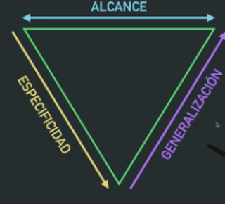
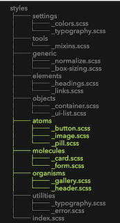

# Estructura los estilos de tu aplicación: Comparando sistemas de arquitectura

# Atomic Design: comparte lenguaje entre diseño y desarrollo

[Post original de Brad Forst.](https://atomicdesign.bradfrost.com/table-of-contents/)

Consiste en varios elementos:

### Átomos

Las **piezas más pequeñas** e indivisibles del diseño. Siempre necesitarán de más contexto para tener sentido en la app. (Botones, labels, inputs, ...)

### Moléculas

Un **conjunto de átomos** que ya tienen mas significado dentro de la app. (botón con label, ....)

### Organismos

Ya son **componentes formados de varias moléculas** que podríamos poner en la app en una página o en otra.

### Template/Page

Definen la estructura del layout de cada página. Su principal **responsabilidad es coger los organismos y posicionarlos en el layout**.

```html
styles
├── atoms
│       ├── _button.scss
│       ├── _image.scss
│       └── _pill.scss
├── molecules
│       ├── _card.scss
│       └── _form.scss
├── organisms
│       ├── _gallery.scss
│       └── _header.scss
└── index.scss
```

### ❌ **Pega**

Esta muy orientado a componentización y diseño, por lo que nos puede quedar corto a la hora de  meter clases/utilidades que necesitemos.


# **🔻** **ITCSS: arquitectura para aplicaciones escalables**

[Inverted Triangle CSS](https://www.xfive.co/blog/itcss-scalable-maintainable-css-architecture/).

De lo mas general a lo mas concreto (selectores de **menos especificos a más**.) Jugamos con la cascada de CSS en nuestro favor.



Tendremos 7 capas:

### Settings y Tools

Los dos primeros niveles estas orientados a prepocesadores, definir **variables**, **tipografía**, ...

### Generic

Es donde pondremos **estilos genéricos** como reset o normalize, definición de box-sizing.

### Elements

Definimos los estilos de los elementos HTML (`h1`, `img`, `a`, ...). Sólo trabajamos con **selectores de elemento**. Aquí **ya empezamos a aplicar estilos** propios que cambiarán el aspecto de nuestra app.

### Object

En esta capa **ya empezamos a crear clases**. Son objetos muy reutilizables que añaden patrones de **estructura pero sin añadir decoración.** (`.container`, `.ui-list`, ...)

### Components

El grueso de nuestra app. Clases que añaden estilos mas allá de estructura. Al ser mas específicos, son menos reutilizables  (por ejemplo `.main-header`).

### Utilities

**Utility-Classes** como `.is-error`, `.is-centered`, ... para **sobreescribir los estilos anteriores**. Para ello, usaremos `!important`. **Lo mas especifico** que tendremos en nuestra app.

Aunque con ITCSS tenemos una estructura muy clara donde poner nuestros estilos, la carpeta ***components\* tenderá a crecer mucho**. Aún así, ITCSS pretende ser un sistema flexible y deja a nuestra elección como organizar los componentes. Una estructura de carpetas podría quedar así:

```html
styles
├── settings
│       ├── _colors.scss
│       └── _typography.scss
├── tools
│       └── _mixins.scss
├── generic
│       ├── _normalize.scss
│       └── _box-sizing.scss
├── elements
│       ├── _headings.scss
│       ├── _images.scss
│       └── _links.scss
├── objects
│       ├── _container.scss
│       ├── _grid.scss
│       └── _ui-list.scss
├── components
│       ├── _button.scss 
│       ├── _card.scss 
│       ├── _forms.scss
│       ├── _header.scss
│       └── ...
├── utilities
│       ├── _typography.scss 
│       └── _error.scss
└── index.scss
```

# Lo mejor de los dos mundos

**❌ Atomic Design:**  esta muy orientado a diseño, por lo que los **ficheros de utils, normalize, etc. nos pueden quedar desubicados**.

**❌ ITCSS:** Los ficheros de css están bien organizados por especificidad, pero l**a carpeta components puede crecer demasiado y no hay un criterio para organizarlo**.

✅ **Combinando ambos sistemas** podemos solucionar las carencias de los dos.



Otros sistemas de arquitectura CSS:

- [OOCSS](https://www.smashingmagazine.com/2011/12/an-introduction-to-object-oriented-css-oocss/)
- [SMACSS](http://smacss.com/)