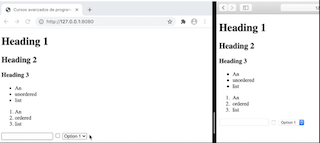
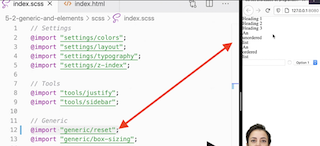
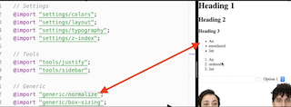

# Aplica arquitectura CSS: trabajando con estilos globales

# Como utilizar variables, mixins y funciones

(Carpeta Settings + Tools)

[Código en Github.](https://github.com/CodelyTV/css-architecture-course/tree/main/5-1-settings-and-tools)

Para las variables es recomendable usar variables para definir colores, por ejemplo. Y luego usar otros con nombre mas semántico para definir sus aplicaciones.

```css
:root {
	--eucalyptus: #289f5f;
  --green-pea: #19623b;
  --baltic-sea: #282729;
  --cod-gray: #181818;	
}

.button {
	--button-background-color: var(--eucalyptus);
	
	background-color: var(--button-main-background-color)
}
```

# La base del CSS: Estilos globales

(Carpeta Generic)

[Código en GIthub](https://github.com/CodelyTV/css-architecture-course/tree/main/5-2-generic)

Cada navegador tiene sus estilos por defecto a la hora de mostrar como se muestra cada elemento.



Para intentar nuestra app se vea en todos igual, se suele usar reset o normalize.

- **[Reset:](https://meyerweb.com/eric/tools/css/reset/)** Quita los estilos por defecto de todos los elementos (`<h1/>` y `<small>/` son del mismo tamaño, `<strong/>` no será en negrita, ...), por lo que **así controlamos desde 0 todos los estilos de los elementos** (respeta los inputs).

  

- **[Normalize:](https://necolas.github.io/normalize.css/)** Normaliza los estilos entre navegadores pero dejando las diferencias entre elementos.

  

En general es más **recomendable usar un normalize**, ya que **algunos estilos genéricos por defecto seguirán aplicando** y nos quitará algo de trabajo, **pero seguiremos teniendo una base de estilos coherente**.

# Empezando a aplicar estilos propios

(carpeta Elements)

[Código en Github](https://github.com/CodelyTV/css-architecture-course/tree/main/5-3-elements)

Aquí se estilarían los **elementos de HTML.** Aún **no escribiremos ninguna clase**, sino que definimos **cómo se mostrarán los elementos**. Lo más habitual será definir estilos de tipografía y enlaces.