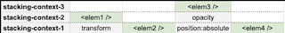

# Z-index y los stacking contexts

- [Demo](https://codelytv.github.io/css-layouts-best-practises-course/4-3-understanding-z-index/)

Por defecto, los elementos se posicionan según su orden en el DOM. Los que vengan después **taparán a los anteriores**.

- Esto también pasa si le asignamos el mismo valor de `z-index`.
- `z-index` a un elemento que esté posicionado (`position: relative` )**no hace nada.**

Los `z-index` sólo compiten entre *[**stacking contexts](https://developer.mozilla.org/en-US/docs/Web/CSS/CSS_Positioning/Understanding_z_index/The_stacking_context)* hermanos.**

- Cada vez que a un elemento le añadimos `position: absolute`, `opacity`, `transform`... (cualquier estilo que puede tocar el eje Z), le incrementamos el *stacking-context*.

  

  

  Por lo que si aunque a `<elem2 />` le pongamos un `z-index:999` no se pondrá por encima de `<elem1 />` ni `<elem3 />`, ya que están en un *stacking-context* superior.

Para proyectos grandes donde tengamos que posicionar varios elementos, es buena idea tener una [escala de `z-index`](https://gist.github.com/toadkicker/fc290e84d7bd861e3e73) y usar variables con nombres semánticos para poder definir y documentar mejor los estilos.

🔝 [Z-index & Stacking Contexts por Josh Comeau](https://www.joshwcomeau.com/css/stacking-contexts/)