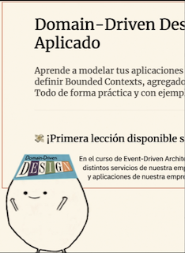
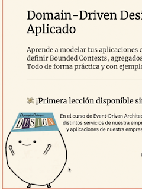

# **Block Formatting contexts: Float sin clearfix!**

- [Demo](https://codelytv.github.io/css-layouts-best-practises-course/5-1-float/)

El `float` puede ser util, por ejemplo, para cuando se quiere posicionar una imagen al lado de un párrafo de texto.

```css
.image {
	float: left;
}
```


Si queremos que el texto, en vez de cortarse en linea recta, vaya **en torno al contorno de la imagen**, podríamos usar la propiedad del `shape-outside` con la url de un *.**png\* con fondo transparente.** Incluso le podemos meter **margen al shape** con `shape-margin.`

```css
.image {
	float: left;
	shape-outside: url('~assets/images/rico.png');
	shape-margin: 1rem;
}
```


Pero el **problema** con los `float` es que **el elemento no entraría en el bloque del div,** por lo que si ponemos bordes, background etc. puede no cuadrar. Por eso se usaba el [*clearfix*](https://css-tricks.com/snippets/css/clear-fix/).



Hoy en día, tenemos la propiedad `display: flow-root` y se podríamos **poner al container. L**o que hace es crear un *[block-formatting-context](https://developer.mozilla.org/en-US/docs/Web/Guide/CSS/Block_formatting_context)*  que **agrupa los elementos hijo** en incluso hace que los **margins del container entren dentro** del *block-formatting-context* creado.

