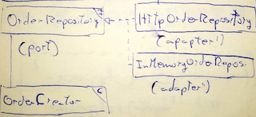

# Patrón Repository



El servicio _OrderCreator_ tendrá un _OrderRepository_ como dependencia

Al _DomainService_ se le <u>inyecta el puerto como dependencia</u> y su implementación (_adapter_) se decidirá en tiempo de ejecución (_InMemory_, _Http_, ....).

<u>Ganamos cambiabilidad</u> porque así, independientemente del _adapter_ qué se use, <u>el código del _OrderCreator_ no cambia</u>.

El <u>repositorio siempre interactuará con el AR</u> (siempre con `order`, nunca con `order.line`)

## Role Interface VS Header Interface

Las interfaces <u>tienen que ser por _Role_</u>. Es decir:

- <u>Agnósticos</u> a infraestructura.
- Que <u>definan comportamiento/contrato.</u>
- <u>Primero el contrato</u>, luego la implementación.

```tsx
interface OrderView {
	public viewById(orderId id);
	public searchByCriteria(OrderCriteria criteria);
}
```

<u>Sacar las cabeceras de los métodos tal cual después de hacer la implementación</u> (_Header Interface_) <u>acopla el contrato a la implementación</u> (**SMELL!**)

```tsx
interface OrderView {
	// key y limit huelen a detalles de implementación
	public searchByKey(int key, int limit);
}
```

El contrato se debe de <u>especificar sobre el uso</u> que hará el cliente y <u>adaptar la implementación al contrato.</u>

## Comunicación entre Bounded Contexts

Si un _Video_ necesita saber algo de un _User_, teniendo <u>cada uno su propio BC</u>, hay <u>dos opciones</u>:

- <u>Inyectar el _ApplicationService_</u> de UserBC a VideoBC, dónde estará la lógica que necesitará. Opción rápida pero <u>mala</u> porque estamos <u>generando acoplamiento.</u>
- Que se <u>comuniquen mediante **eventos de dominio**</u>. Mas <u>costoso</u> de implementar, pero <u>no acoplamos</u> y cada BC es <u>independiente</u>.
