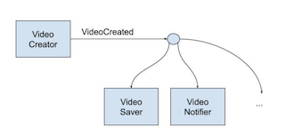

# Eventos de Dominio

Puede darse el caso de que el servicio <u>_VideoCreator_ crezca demasiado</u> porque tiene que <u>hacer demasiadas cosas</u>.

```tsx
create() {
	save();
	notify();
	....
}
```

Al <u>usar eventos de dominio dividimos responsabilidades</u>, ganando en <u>rendimiento, independencia y modelado</u> de datos.



Son clases pequeñas con sólo el <u>método para darnos el nombre del evento</u>.

### Responsabilidades:

- El <u>agregado genera el evento, no lo pública.</u>
- El <u>caso de uso</u> tiene (aparte de la lógica de llamadas, etc.) lógica para <u>decirle al agregado que genere el evento y publicarlo.</u>

```tsx
// ReceivePurchaseHandler.ts
public async execute(...){
	// Generar el evento con el agregado y pasarselo al publicador
	const purchase = Purchase.receive(...);
	await this.purchaseRepository.receive(purchase);
}

//HttpPurchaseRepository.ts
public async receive(purchase){
	await this.client.post('/receive-purchase', {somePayload});
	this.eventBus.publish(purchase.pullEvents());
}
```
