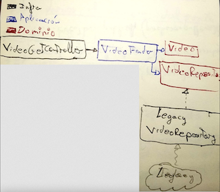
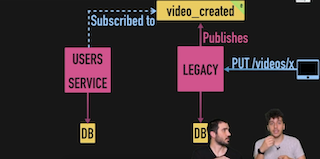

# **Migrando Sistemas Legacy gracias a la Capa Anticorrupción**

### Definiendo contratos a <u>nivel de interfaces de Dominio</u>

- Definiremos el contrato **outside-in (**desde fuera hacia dentro) <u>en base al caso de uso.</u>
- <u>Nunca **bottom-up**</u> (que el detalle de implementación fije el contrato).



- Definiremos en el dominio <u>un contrato en una _Role Interface_ como contención</u> (en este caso _VideoRepository_). Nuestra nueva arquitectura no sabrá del legacy y <u>esperará un comportamiento en base a ese contrato.</u>
- El <u>_LegacyVideoRepository_ implementará ese contrato</u> y como capa <u>infraestructura</u>, estará <u>acoplado a los detalles de implementación del _Legacy_</u>. Pero estos detalles se quedarán ahí y <u>devolverá entidades de dominio.</u>

### Definiendo contratos a <u>nivel de eventos de Dominio</u>

- Ir extrayendo pequeñas partes pasito a pasito. Por ejemplo, la parte de usuarios **con su infra. y DB**.
- El legacy se comunicará con el "nuevo servicio" mediante eventos de dominio. Por ejemplo, para saber cuando un usuario crea un nuevo video, **el legacy publicará el evento "video_created" que será escuchado por el nuevo \*UsersService\***.



- No nos interesa mejorar la parte del legacy, por lo que la regla del **\*BoyScout\* no aplica**. En el legacy nos limitaremos a publicar el evento y ya esta.

- Para recuperar datos de videos viejos

  (que no estén en la nueva DB), hay diferentes estrategias:

  - Script para **migrar datos** de la vieja DB a la nueva.
  - **Fallback para consultar la vieja DB** en caso de que el dato no exista en la nueva.
  - ...

- Es importante entender que **estos eventos no son eventos de dominio como tal**. Si no que son **mensajes** que publicaremos en una cola, **que responden a una estructura de DB** **concreta** y consumiremos para sincronizar el nuevo sistema.

### Implementando Eventos de Dominio

- **Evento de Dominio**: Suceso que ha pasado

```json
{
  "data": {
    "id": "064899d2-b981-4f5-81b1-f3b4e4115d6f", // Id del evento
    "type": "codelytv.video.video.event.1.video.published", // tipo de evento
    "ocurred_on": "2019-02-27T11:00:00+00:00",
    "attributes": {
      // Atributos del agregado
      "id": "6b2ae936-3c87-4c84-815c-9f826b87a08c", // Id del agregado
      "type": "screencast",
      "title": "DDD en 20 minutos",
      "url": "<https://www.youtube.com/watch?v=dH5aSQLXtKg>",
      "course_id": "eb65a3d2-9abb-423d-ac7d-0342e4ba6f45"
    },
    "meta": {
      // Cosas que no son de dominio (para tracear, ...)
      "host": "205.134.138.99",
      "correlation_id": "1f253d28-2d9e-45e9-9c2b-6cde103910"
    }
  }
}
```

- Tendremos clases **\*subscribers\*** **que mediante el bus** **escucharan a los eventos** pertinentes (la relación puede ser _1:N_), que una vez recibido el evento ejecutará el _callback, caso de uso, etc._
