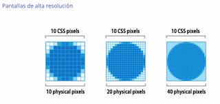

# Taller Web Performance - Nucliweb

[Slides](https://slides.com/joanleon/taller-de-web-performance-05-2021?token=kzexINcS)

# Chapter 01

[Grabación del chapter 01](https://www.youtube.com/watch?v=0z1dN0YGF1M)

- Cada vez las webs estan pesando más.

  - `sudo tcpdump -i en0` --> para ver el trafico de nuestra red en terminal.

- [Objeto PerformanceOberserver en JS](https://developer.mozilla.org/en-US/docs/Web/API/PerformanceObserver)

  - [PerformanceObserverEntryList](https://developer.mozilla.org/en-US/docs/Web/API/PerformanceObserverEntryList)

- [Documentatión de métricas en web.dev](https://web.dev/vitals/)

  - No obsesionarse con el TTI (*Time To Interactive*), pueder ser engañoso. Ya que no mide  que la web sea usable, si no cuando se ejecuta el último task que dura mas de 50ms (a.k.a Long Tasks) en una <u>ventana de 5 segs</u>.. 

    **Consejo:** se pueden cargar esos <u>Long-tasks</u> fuera del Main Thread en un ServiceWorker, y así al no correr en el hilo principal no se considerarán como Long Tasks y no afectarán al TTI.

- [LightHouse Calculator](https://googlechrome.github.io/lighthouse/scorecalc/) --> ver como afecta el cambio de las metricas a la puntuación

- Los [Core Web Vitals](https://web.dev/vitals/) <u>afectan al posicionamiento</u> de las páginas (SEO)

## Monitorización

- Conviene <u>monitorizar la performance de la competencia</u>:
  - Un OKR bueno es llegar a tener un 20% score mejor que la competencia.
- El añadir/quitar features seguramente cambiará el score, por lo que conviene no perderla de vista. 
- Mejor usar una <u>herramienta (e.g [DebugBear](https://www.debugbear.com/)) que use un LightHouse "remoto"</u>, en vez de usarlo en nuestro local. Ya que en local se verá afectado por nuestro SO, red, extensiones, etc.
  - Tambien, usar las mismas herramientas y  metricas en las mediciones, tener en cuenta la geolocalización,...
  - Depurando tu rama local, puede ser complicado usar un servicio externo. Un workaround puede ser correr <u>varias pruebas para ver qué aspecto se puede mejorar</u>.


# Chapter 2

[Grabación del chapter 02](https://www.youtube.com/watch?v=1pavyn1tDaU)

## ¿Como funciona el navegador al cargar una web?

- Probar las webs en https://www.webpagetest.org/
  - La primera imagen, cuanta mas larga sea, es señal de que mas recursos necesita la web.


- En una PR podríamos introducir tests de performance.
  - Cuantos CSS/recursos no estamos usando?

## Minificar CSS

- Todos los recursos (imagenes, css, etc.) <u>mejor en local</u> que accesibles por url.

  - Por ejemplo, una carpeta 

    ```
    ./assets/
      |css/
      |images/
      |...
    ```

- Cuidado con librerías de utilidades, animaciones, etc
  - Por ejemplo, [AnimateCss](https://animate.style/).  Da muchas opciones de animaciones pero **demasiadas**. Mejor <u>escribir/copiar sólo los que nos hacen falta</u>.
- Cargar sólo el <u>CSS necesario</u>

#### Css Nano

- https://github.com/cssnano/cssnano
- Una vez configurado el proceso de bundling para que corra con PostCss, configurar el plugin *cssnano* en el `postcss.config.js` 

#### Autoprefixer

- https://github.com/postcss/autoprefixer
- Mete prefijos y elimina los que no se necesitan

```javascript
// postcss.config.js
const cssnano = require("cssnano");
const autoprefixer = require("autoprefixer");

module.exports = {
	plugins: [
    ... ,
		cssnano(),
	  autoprefixer(),
  	... 
	]
}
```

## Aplazar (a.k.a Defer) la carga del CSS no crítico

- [Critical CSS](https://web.dev/extract-critical-css/)

- Cargará el recurso CSS pero con el *<u>preload</u>* no afectará a la carga de la página. En el *<u>onLoad</u>* le diremos que se trata de un *<u>stylesheet</u>*, por lo que lo parseara como estilo.

  ```html
  <link rel="preload" href="..." as="style" onload="this.onload=null; this.rel='stylesheet';"/>
  ```

## Cargar el CSS según la media query

- Para esto necesitamos hacerlo en varios pasos:
  1. Sacar las media-queries
     - Usaríamos el plugin [CssStats](https://www.npmjs.com/package/cssstats) de PostCSS.
     - Escribir un archivo por cada Media-Query
  2. Cargar el CSS de la media-query que toca.
     - Usando el [Media-Query-Plugin](https://github.com/SassNinja/media-query-plugin)

Esto nos meterá un tag `link` de con un atributo `media` especificando la media-query. Esta linea sólo aplicará cuando el `media` cumpla la condición.

```html
<link rel="preload" href="..." as="style" media="(min-width:700px)" onload="this.onload=null; this.rel='stylesheet';"/>
```

### Optimizar las imágenes de background con media-queries

```css
/*
* 1. try loading Avif, 
* 2. if not avif not supported --> fallback to webp
* 3. if webp not supported --> fallback to jpg
*/
background-image: image-set("foo.avif" type="image/avif",
														"foo.webp" type="image/webp",
														"foo.png" type="image/png");
```

### Optimizar las fuentes

Fuentes tambien en <u>local</u>. SI usamos <u>GoogleFonts nos bajará todas</u>.

- https://www.zachleat.com/web/comprehensive-webfonts/
- https://csswizardry.com/2018/11/css-and-network-performance/
- https://deploy-preview-15--upbeat-shirley-608546.netlify.app/posts/high-performance-web-font-loading/
- https://twitter.com/addyosmani/status/1395997862065053696

## Imagenes y videos en la web

- Una imagen en <u>.*png* si no tiene transparencia</u>, no tiene <u>ningun sentido</u>. 

  - Prioritariamente, usar *.webp* y como fallback .*png*.

    

#### Usar **CDNs de imagenes** 

**query-param `auto=format`**

- https://web-dev.imgix.net/image/vS06HQ1YTsbMKSFTIPl2iogUQP73/I83Y9EaBPBXbE6TywvLg.png?auto=format&w=1600
- Esta imagen con el `auto=format` <u>devuelve un webp de 300KBs pero sin el query-param pesa 3MB</u>

**Tener en cuenta los tamaños que hay que presentar**

- Establecer los tamaños y usar la query-param `w=:tamaño:` (por ejemplo w=400) para ajustar la imagen
- https://web-dev.imgix.net/image/vS06HQ1YTsbMKSFTIPl2iogUQP73/I83Y9EaBPBXbE6TywvLg.png?auto=format&w=1600

**Cuidado con los zoom**

- No descargar una imagen de 2 MBs para tenerla pequeña por si el usuario hace zoom. Presentar una imagen pequeña y pedir una imagen a mayor calidad/escalada/cropeada para cuando se quiere hacer zoom. 

#### El mejor formato según el caso de uso

- Tener en cuenta las <u>densidades de pixeles en pantallas de alta resolución</u>

  

- Decidir bien el <u>[formato a elegir según la necesidad](https://99designs.es/blog/tips/image-file-types/)</u>.

- Imagenes <u>[progresivas](https://www.thewebmaster.com/dev/2016/feb/10/how-progressive-jpegs-can-speed-up-your-website/) son mejores en UX</u>.
- [WebP casi con soporte 100%](https://web.dev/uses-webp-images/) 
- Futuro en [AVIF](https://css-tricks.com/avif-has-landed/)

#### Micro Optimizaciones

- El ojo humano diferencia <u>mejor los contrastes de luz/luminosidad (blanco y negro)</u> que entre colores (chroma subsampling)
  - https://dexecure.com/blog/intelligent-chroma-subsampling/
  - https://squoosh.app/
- convertir los png en jpg
- Usar herramientas de optimización (diferentes opciones).
  - https://image-shrinker.com/
- Se puede desenfocar el fondo (reduciendo así el peso de la imagen).
- Validar las compresiones/optimizaciones (pesos, cargas, etc.)

#### Percepción VS Realidad

- Mientras se produce la carga hay diferentes tecnicas para mejorar la UX y hacer que la web sea comprensible sin tener que esperar a las imagenes.

  - Introducir placeholders que ocupen el espacio que ocupará la imagen.

    - Una imagen standard.

    - Colores de fondo

    - La imagen ultra minificada, luego ampliada al tamaño a mostrar y un blur aplicado

    - Siluetas

      

# Chapter 03

- **Critical CSS:** lo que se carga <u>antes del fold</u> ("above the fold") 

  - **fold**: lo que pasa antes de cualquier navegacion/scroll. (a.k.a <u>lo que sale primero</u>) (a.k.a primera plana)

- **Non-Critical CSS:** lo que viene <u>después del fold</u>

- El <u>fold puede ser diferente en desktop o en mobile, ya que en viewport puede ser distinto.</u>

  - Lo ideal es ser Data-Driven y saber que dispositivos te visitan para saber que viewport deberías de soportas.

- Algunas herramientas:

  - [Critical](https://github.com/addyosmani/critical): se usa como modulo JS y configurarlo para el bundling
    - Extrae el CriticalCSS y lo inserta en el <head> con una estiqueta <style>
  - [Html-critical-webpack-plugin](https://github.com/anthonygore/html-critical-webpack-plugin)
    - Saca el CriticalCSS en runtime. Al entrar en una página, te detecta el viewport del dispotivo, te extrae el CriticalCSS para ese viewport y te lo expone.
    - Al hacerlo en runtime, mete **latencia**.
  - [Sui-Critical-CSS]()
  - Critical-css-webpack-plugin
  - criticalcss

  ### Ejemplo con html-webpack.plugin

  - Instalarlo como dependendia y configurarlo en el *webpack.config.js*
