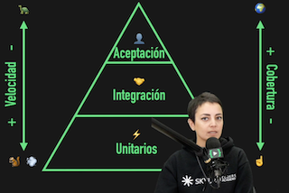
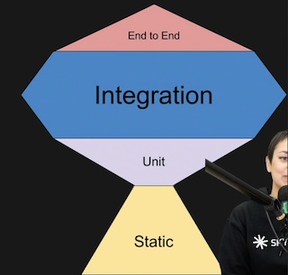
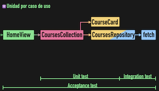
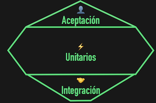
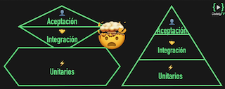

# Definición de nuestra estrategia de testing

# Agnóstica del framework

- La mayor diferencia entre testear el componente de Vue, React, ... estaría en como renderizarlo. Luego testearíamos basandonos en la interacción que tendría el usuario con él.

# Redefiniendo el testing en frontend

- [código en Github](https://github.com/CodelyTV/javascript-testing-frontend-course/tree/main/22-unit-test)
- Flaky tests:

Tradicionalmente se plantean los test usando una pirámide.

⚡  **Unitarios:** Rápidos de hacer y ejecutar, pero que dan poca cobertura.

🤝  **Integración**: Mas cobertura pero más lentos, ya que integramos varias partes del código, incluso partes externas.

👤 **Aceptación/e2e**: Cubren toda la app pero muy lentos de ejecutar, ya que tenemos que levantar toda la app.

Entonces se planteo **cambiar la piramide por el trofeo de testing,** y escribir tests **mayormente de integración**.

- Fijarse que la base del trofeo se compone de **análisis estático (typechecking, linting, ...)** esto nos puede llegar dado por herramientas como **typescript, eslint**, ...
-  se presenta el trofeo de testing.

Por ejemplo, vemos este ejemplo:

❌ Si testeasemos todo parte por partes (**unitariamente**) en cada tests, mockeando todo lo demas, los tests nos dan poco valor. Si no mockeasemos las dependencias, nuestra app necesitaría conectarse a una api externa, lo que haría nuestro test unitario muy lento, especialmente si necesitásemos testear el *happy-path*,  todos los casos de nuestra lógica de negocio y *edge-cases*.

✅ La división seria:

- Deste el `HomeView` hasta la llamada final con el fetch, lo meteríamos dentro de los **AcceptanceTests/e2e** ya que estamos **testeando el caso de uso de punta a punta**.
- **La unidad del caso de uso** lo testearíamos contra el `CoursesCollection` ya que **es donde esta la lógica de negocio de cursos** (`HomeView` además de cursos puede tener usuarios, posts, ...). Usaríamos el CoursesCollection para atacar también contra el `CourseRepository` pero **mockeariamos el \*fetch\*** para no tener que hacer llamadas reales a la API y evitar que los tests sean demasiado lentos. Como no atacamos contra una API externa, no consideramos estos tests como de integración.
- Los tests del **repository contra la API real**, los consideramos como tests de **integración**. ****Testear las llamadas y los valores que devuelve el repository haciendo uso de la api real.

Notar las diferentes capas:

- `CourseCollection` es servicio de **aplicación** que tiene la lógica de negocio.
- El `CourseCard` y el `CourseRepository` son elementos de **dominio** (Ports, entitades, ...)
- La implementación del `CourseRepository` y el fetch sería parte de la **infraestructura**.

Entonces, viendo todo esto veríamos que **nuestra mayor parte de tests seguiría siendo unitaria pero bien planteada** con el planteamiento que acabamos de hacer. Ya que como no atacamos a una API externa, **no los consideramos de integración**.

Por lo que **ordenando un poco las piezas** de mayor a menor cantidad de tests, **volveremos a la pirámide.**

