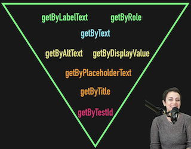

# Buenas prácticas del testing en frontend

# Testeando lo que de verdad importa

- [Código en Github](https://github.com/CodelyTV/javascript-testing-frontend-course/tree/main/31-testing-important-stuff)

No hay que testear detalles de implementación sino lo que "ve" el usuario:

```jsx
describe("Error Toggle", () => {
  it("should toggle open property when button is clicked", async () => {
		// ❌ shallowMount mockea children
    const wrapper = shallowMount(ErrorToggle);
		
		// ❌ estamos buscando por #id
    const button = wrapper.find("#toggle-message"); 

    button.trigger("click");

		// ❌ estamos comprobando propiedades de View
    expect(wrapper.vm.open).toBe(true);

    button.trigger("click");
    expect(wrapper.vm.open).toBe(false);
  });
});
```

El test de arriba se puede mejorar para testear desde el punto de vista del usuario:

🤯

```jsx
describe("Error Toggle", () => {
  it("should toggle contact message when button is clicked", async () => {
		// ✅ usamos mount() para que se mockeen los children
    const wrapper = mount(ErrorToggle);

		// ✅ buscamos el elemento por data-test-id (tambien podría ser byRole, byText,...)
    const button = wrapper.find('[data-test-id="toggle-message"]');
    button.trigger("click");

		// 🤯 CUIDADO con esto! 
    await nextTick();

		// ✅ buscamos el elemento por data-test-id (tambien podría ser byRole, byText,...)
    let message = wrapper.find('[data-test-id="message"]');
    expect(message.exists()).toBe(true);
    expect(message.text()).toMatch(/contact us/i);

    button.trigger("click");

		// 🤯 CUIDADO con esto! 
    await nextTick();

// ✅ buscamos el elemento por data-test-id (tambien podría ser byRole, byText,...)
    message = wrapper.find('[data-test-id="message"]');
    expect(message.exists()).toBe(false);
  });
});
```

Este test nos da mucha mas confianza, aunque vemos el `await nextTick()` que tenemos que usar para esperar a que el DOM cambie.

Para evitar tener que usar `nexTick(), data-test-id` hardcodeados, etc. podríamos usar el [**patrón PageObject**](https://martinfowler.com/bliki/PageObject.html) que nos brinda u**na capa de abstracción para interactuar mas claramente con el componente en el test**.

```jsx
import { nextTick } from "vue";

export default class ErrorPageObject {
  constructor(wrapper) {
    this.wrapper = wrapper;
  }

  text() {
    return this.wrapper.text();
  }

  async wait() {
    await nextTick();
  }

  hasErrorMessage() {
    return this.wrapper.find('[data-test-id="message"]').exists();
  }

  clickToggleButton() {
    this.wrapper.find(['data-test-id="toggle-message"]').trigger("click");
  }
}
```

Usando esta clase, nuestro test queda mucho mas claro.

```jsx
describe("Error Toggle", () => {
  it("should toggle contact message when button is clicked", async () => {
    const wrapper = mount(ErrorToggle);

		// Instanciamos el PageObject
    const page = new ErrorPageObject(wrapper);
	
		// Usamos las utilidades que da el PageObject sin tener que hardcodear data-test-id
    page.clickToggleButton();

		// Ahora el test no sabe nada sobre nextTick()
    await page.wait();

    expect(page.hasErrorMessage()).toBe(true);
    expect(page.text()).toMatch(/contact us/i);

    page.clickToggleButton();

    await page.wait();

    expect(page.hasErrorMessage()).toBe(false);
  });
});
```

# Ejemplo con Testing Library: testing centrado en el usuario

- [Ejemplo en Github](https://github.com/CodelyTV/javascript-testing-frontend-course/tree/main/32-testing-as-a-user)

En Testing Lib. tenemos varios tipos de [queries](https://testing-library.com/docs/queries/about/) para buscar los elementos. Una query comun es el `getBytRole()` , donde podremos buscar componentes por **roles de accesibilidad**.

```jsx
screen.getByRole("button", { name: /toggle/i })
```

Aquí también, el patrón **PageObject** nos permitirá e**ncapsular código para evitar duplicar código** y que los métodos sean mas semánticos.

# Tests semánticos y más legibles

- [Ejemplo en Github](https://github.com/CodelyTV/javascript-testing-frontend-course/tree/main/34-semantic-tests)

Teniendo el siguiente test:

```jsx
describe("Error Toggle", () => {
  it("should display message when button is clicked", async () => {
    render(ErrorToggle);

    const button = screen.getByRole("button", { name: /toggle/i });
    await fireEvent.click(button);

    const message = screen.getByRole("alert");
    expect(message).toBeTruthy();
    expect(message.innerHTML).toMatch(/contact us/i);

    await fireEvent.click(button);

    expect(screen.queryByRole("alert")).toBeFalsy();
  });
});
```

`toBeTruthy` nos da poca información, y tener que acceder al `innerHTML` para hacer un match de texto no se lee fácilmente.

Para mejorar estas cosas, Testing Library nos ofrece la librería de **matchers** [**Jest DOM](https://github.com/testing-library/jest-dom):**

Vemos que así las aserciones y los errores de cuando falla el test  son mucho **más legibles para developers e incluso alguien de negocio**.

```
expect(message).toBeInTheDocument();
expect(message).toHaveTextContent(/contact us/i);
```

# **Testeando accesibilidad**

## **Automatizar tests de accesibilidad con Jest Axe**

- [Código en Github](https://github.com/CodelyTV/javascript-testing-frontend-course/tree/main/41-a11y-axe)

La accesibilidad en el desarrollo web es muy importante por tres motivos:

- Permite que **todo el mundo pueda acceder al contenido** independientemente de sus capacidades.
- **UX mejor**.
- Ayuda al **posicionamiento** de nuestras páginas
- Finalmente, tal vez el menos evidente: hace que nuestros **tests sean más fáciles de escribir**.

Si tenemos **un formulario sin labels**, donde el botón no tiene texto, para conseguir interactuar con todos los elementos tenemos que recurrir o bien a añadir atributos `data-test-id` en nuestro código, o bien recurrir a confiar en el orden de los elementos html.

### ❌

```jsx
const name = screen.getByText(/name/i);
userEvent.type(name.nextSibling, "Jane");
```

Vemos que esto es más complicado y frágil que si el input tuviera un label asociado:

### ✅

```jsx
const nameInput = screen.getByLabelText(/name/i);
userEvent.type(nameInput, "Jane");
```

Aunque podamos usar estas queries, **habrá ocasiones en que no las podamos usar sin tener que refactorizar** (e.g en legacy), por lo que **aun así podremos usar los** `data-test-id`, ...

### Validando la accesibilidad

[Jest Axe](https://github.com/nickcolley/jest-axe) es una librería que **extiende los asserts de jest y nos permite checkear la accesibilidad.**

```jsx
import { axe, toHaveNoViolations } from "jest-axe";
import { render } from "@testing-library/angular";
import { MyComponent } from "../components/my-component.component";

expect.extend(toHaveNoViolations);

describe("MyComponent", () => {
  it("should be accessible", async () => {
    const { container } = await render(MyComponent);

    expect(await axe(container)).toHaveNoViolations();
  });
});
```

**Ojo!** **Que el test pase no garantiza que el código sea 100% accesible**, ya que todo no es automatizable (layout, colores, ....). De todas formas, es un **buen punto de partida**.

## Selectores accesibles

- [Ejemplo en Github](https://github.com/CodelyTV/javascript-testing-frontend-course/tree/main/42-a11y-selectors)
- [Roles de accesibilidad](https://developer.mozilla.org/en-US/docs/Web/Accessibility/ARIA/ARIA_Techniques#roles)
- [Prioridad de queries de Testing Lib.](https://testing-library.com/docs/queries/about/#priority)

Las queries que nos ofrece Testing Library nos ayudan a que nuestro código sea accesible, pero es normal que a veces no tengamos claro qué query es mejor usar en cada contexto:

- Para **interactuar con inputs** lo mejor es usar `ByLabelText`. Necesitaremos que cada input tenga una label asociada.
- En los **casos que no tengamos**, podemos usar `ByPlaceholder` o `ByDisplayValue` (puede ser útil al testear formularios de edición en los que los inputs ya tienen un valor).
- Para otros **elementos interactivos** (links, botones, ...) lo mejor es `ByRole`, lo que nos permite seleccionar elementos según su rol de accesibilidad. Incluso puede ser util para seleccionar títulos, articulos, etc.
- `ByTestId` debe de ser nuestro **último recurso**. Ya que requiere tocar el código para introducir ese `data-test-id` y es un atributo que no da ninguna información al usuario.

