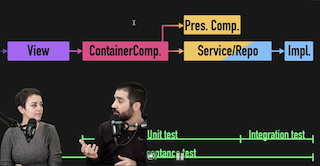

# Testeando componentes complejos

## Entendiendo cuando es necesario mockear

- [Código en Github](https://github.com/CodelyTV/javascript-testing-frontend-course/tree/main/61-mocking)

> Cuanto mas mockeemos, menos se pareceran nuestros tests a la interacción con el usuario. [Testing-lib Guiding Principles.](https://testing-library.com/docs/guiding-principles/)

**El punto de corte de los tests unitarios sería lo que se comunica con una capa externa. Todo lo que toca I/O o tenga latencia.**

- Por ejemplo, la `fetch` api. Las requests son lentas por lo que al mockearlos nos pueden dar agilidad en los unitarios.
- Una utilidad de *npm* que se ejecuta de forma síncrona no valdría la pena, ya que la ejecución es tan rápida que el mock no nos aportaría nada.



Con Jest se pueden [mockear](https://jestjs.io/es-ES/docs/mock-functions) los módulos facilmente.

- Poner estos al principio del fichero, ya que al transpilarse, estos mock se ponen al principio del fichero también. Por lo que así, nos queda claro cuando se ejecutarán.
- **Limpiar los mocks** cada vez que se termine un test. Poniendo un `restoreMocks: true` en el *jest.config.js* se limpiaran los mocks **despues de cada test-case**.

```jsx
jest.mock("../services/CoursesRepository");
```

## ⚠️ Peligros de mockear fetch

- [Código en Github](https://github.com/CodelyTV/javascript-testing-frontend-course/tree/main/62-mocking-fetch)

Podemos mockear el fetch de la siguiente manera:

```jsx
beforeAll(() => jest.spyOn(window, "fetch"));

it("should list posts", async () => {
  window.fetch.mockResolvedValueOnce({
    ok: true,
    json: async () =>  [
      // ...
    ]
  });
  // ...
});
```

Pero vemos varios problemas:

- Tenemos que devolver esa función json, atándonos a la implementación.
- Tampoco podemos diferenciar las llamadas que se hacen.
- Tendríamos que usar mockImplementation para poder devolver un resultado u otro en función del path, de si la llamada es POST o GET…

Para solucionar estos problemas, podemos usar **alguna librería que intercepta las peticiones a nivel de network** (las habremos configurado nosotros previamente para que intercepte los endpoints) y que nos devuelva el contenido que hemos falseado.

- [MockServiceWorker (MSW)](https://mswjs.io/)
- [Mirage](https://miragejs.com/)

Por ejemplo, con MSW:

1. Después de instalar la librería, creamos un archivo *server.js* en la carpeta *mocks.*

```jsx
import { setupServer } from "msw/node";

import { handlers } from "./handlers";

export const server = setupServer(...handlers);
```

1. Los handlers es un array que importamos de otro archivo con los **endpoints mockeados**:

```jsx
rest.post(
  "<https://jsonplaceholder.typicode.com/posts>",
  (req, res, ctx) => {
    return res(ctx.status(200), ctx.json([
			// contenido de nuestros posts
    ]));
  }
)
```

1. Aqui, podemos cambiar el contenido de nuestro tes. Los endpoints nos devolverán valores por defecto, pero estos podrán ser modificados en el test para cubrir la casuística que toque.

```jsx
import { rest } from "msw";

export function getPosts(response = [], status = 200) {
  return rest.get(
    "<https://jsonplaceholder.typicode.com/posts>",
    (req, res, ctx) => {
      return res(ctx.status(status), ctx.json(response));
    }
  );
}

export function createPost(response = {}, status = 200) {
  return rest.post(
    "<https://jsonplaceholder.typicode.com/posts>",
    (req, res, ctx) => {
      return res(ctx.status(status), ctx.json(response));
    }
  );
}

export const handlers = [createPost(), getPosts()];
```

1. Para terminar, tenemos que levantar nuestro servidor *fake* al iniciar los tests y configurar el reseteo entre test-cases. Eso es configurable desde el *setupTests.js*:

```jsx
import "@testing-library/jest-dom";
import { server } from "./mocks/server";

beforeAll(() => server.listen());

afterEach(() => server.resetHandlers());

afterAll(() => server.close());
```

1. En los tests, las llamadas a estos endpoints los podríamos usar asi:

```jsx
describe("when user loads the component", () => {
  it("should list posts", async () => {

		/*
	  Para modificar la respuesta que hemos definido en handlers.js, 
    que era un array vacío, podemos modificarlo en el test con **server.use**, 
		pasando la función que exportamos anteriormente con el array de posts que 
		queremos validar que se renderiza correctamente
		*/

    const posts = [
      {
        id: 1,
        title: "My post",
        body: "lorem ipsum",
      },
    ];
		server.use(getPosts(posts));

    render(<Posts />);

    const post = await screen.findByRole("heading", { name: "My post" });

    expect(post).toBeInTheDocument();
  });
});
```

## Testeando animaciones

- [Código en Github](https://github.com/CodelyTV/javascript-testing-frontend-course/tree/main/63-animations)

Una partiduclaridad de testear las animaciones en front es cuando queremos ****testear que un modal desaparece cuando clicamos el botón de cerrar, pero hay una transición de X segundos hasta que éste desaparece completamente.

Hay que **falsear la animación**, si no los tests podrían tardar demasiado.

## Cuando el tiempo de la animación lo tenemos por JS

Podríamos **configurar la duración de la animación** en base a una variable de entorno.

```jsx
const duration = 3000 * (process.env.TIME_SCALE_FACTOR || 1);

<Transition
  appear={true}
  mountOnEnter={true}
  unmountOnExit={true}
  in={showContent}
  timeout={duration}
/>
```

Cuando no configuremos el `TIME_SCALE_FACTOR` el factor de multiplicación será 1, por lo que la duración será la esperada.

Por el contrario, podríamos **configurar el `TIME_SCALE_FACTOR` en los tests como 0** y así las animaciones no tardarían nada.

## Cuando el tiempo de animación lo tenemos por CSS

```jsx
<transition name="fade">
  <div v-if="showContent">
    <h2>A subtitle</h2>
    <p>Lorem ipsum dolor sit amet</p>
  </div>
</transition>
.fade-enter-active,
.fade-leave-active {
  transition: opacity 5s;
}
.fade-enter,
.fade-leave-to {
  opacity: 0;
}
```

⚠️ Podríamos usar una variable CSS y modificarla desde JS, pero es muy **tedioso**.

✅ En Vue, si usamos el componente `<transition>` propio del framework, **el propio test nos mockea/stub-ea ese componente** por lo que el css que establece la duración de la transición no aplica.

- Ver como mockear transiciones en React:
  - [Docu de Testing Library](https://testing-library.com/docs/example-react-transition-group/).