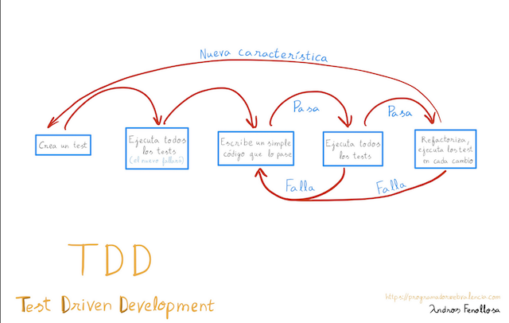

# TDD con Testing Library

- [Aprende TDD de Fran Iglesias](https://leanpub.com/tddcourse)

# Implementando una nueva feature con TDD

Pasos aproximados para el proceso de TDD:

- [Punto de partida](https://github.com/CodelyTV/javascript-testing-frontend-course/commit/97dfb747b174a0f78b1e7dab619fa676adcef685)
- [Añadir el test. Al principio fallará porque la feature no existe.](https://github.com/CodelyTV/javascript-testing-frontend-course/commit/744f5808a451b8cea5279614a9e54028d83f81cf)
- [Añadimos el código.](https://github.com/CodelyTV/javascript-testing-frontend-course/commit/395048b26f6f03a47383c20fce448e3095db3e41)
- [Arreglamos el test.](https://github.com/CodelyTV/javascript-testing-frontend-course/commit/f70c0210fe0ee713285b90d838ac1d4aef2841a1)
- [Refactorizamos el código.](https://github.com/CodelyTV/javascript-testing-frontend-course/commit/23e5d2341d89b430ab8ad9220007abb288fd4c24)

Para cuando nuestra feature depende de timers (setTimeout, ... ) podríamos usar los [fake-timers de jest](https://jestjs.io/docs/jest-object#mock-timers).

- [Commit de ejemplo.](https://github.com/CodelyTV/javascript-testing-frontend-course/commit/325aff02abbfa8964a1ccf3b6faefa9d4e1a8585)