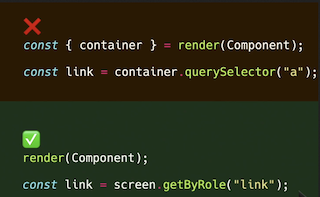
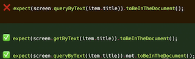
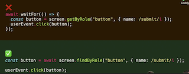

# Errores frecuentes con Testing Library

- [Common mistakes with Testing Lib](https://kentcdodds.com/blog/common-mistakes-with-react-testing-library/)

## ❌ Usar el container para usar querySelectors

Sería correcto usar el HTML devuelto por el container para testear contra snapshots, pero no para buscar elementos.

## ❌ No usar las [queries](https://testing-library.com/docs/queries/about/#types-of-queries) adecuadas

- Para cuando queramos testear que algo **existe** en el DOM, usaremos un ***getBy**...,* ya que petará al no encontrarlo.
- Para testear que algo **NO existe** en el DOM, podremos usar el *queryBy...*

## ❌ Esperar tiempo aleatorio

Antes era común hacer `sleep(1000)` para cuando queríamos esperar en los tests, por ejemplo para cuando queríamos esperar a que un elemento del DOM apareciese.

Testing Lib nos brinda **queries asíncronas** para esto con ***findBy....***

## ❌ Side effects con `waitFor`

- [WaitFor docu](https://testing-library.com/docs/dom-testing-library/api-async/#waitfor)

No testear sideEffect (pinchar en un botón, ...) ya que **el `waitFor` se ejecuta constantemente** hasta que se resuelve. Si no encuentra el botón se intentará constantemente buscarlo.

Mucho mejo, **usar findBy....** para ello.

## ❌ Abusar de `beforeEach`

Aunque nos permite reducir duplicidad de código, pero por contra nos **dificulta la lectura de los tests y hace que sean menos auto-contenidos**.

Es preferible la duplicidad, y si realmente queremos subir un nivel de abstracción usando *PageObject*.

